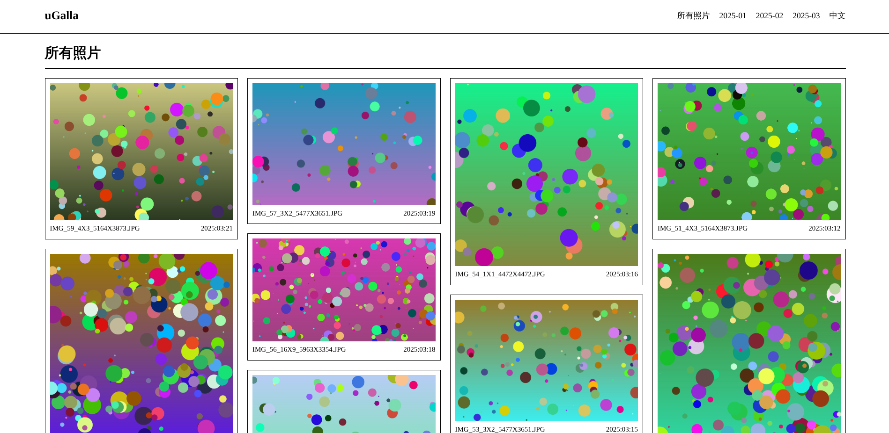

# uGalla

A lightweight photo gallery written in Python. uGalla scans directories of images, extracts EXIF metadata, and serves them in a responsive web gallery with a lightbox viewer.



## Quick Start

```bash
# Clone & enter
git clone <repo> && cd uGalla

# Create venv & install
python -m venv .venv && source .venv/bin/activate
pip install -r requirements.txt

# Generate sample images (optional)
python generate_pseudo_imgs.py

# Run
python app.py
```

Open http://127.0.0.1:5000 in your browser.

## Features

- **Automatic gallery scanning** — place images in `static/imgs/<gallery-name>/` and uGalla picks them up on restart
- **EXIF metadata extraction** — camera make/model, aperture, shutter speed, ISO, focal length, GPS coordinates, date taken
- **Pagination** — 10 images per page with prev/next navigation
- **Lightbox viewer** — click any image to open a full-screen viewer with prev/next navigation
- **EXIF info panel** — click the "i" button in the lightbox to see camera settings and location
- **REST API** — `/api/exif/<gallery>/<filename>` returns JSON metadata for any image
- **Responsive masonry layout** — images displayed in a grid that adapts to screen size
- **Sample data generator** — `generate_pseudo_imgs.py` creates 60 realistic test images with varied EXIF data

## Project Structure

```
uGalla/
├── app.py                    # Flask application (routes, pagination)
├── gallery.py                # GalleryScanner + EXIF parsing (PIL/Piexif)
├── generate_pseudo_imgs.py   # Test image generator with realistic EXIF
├── requirements.txt
├── static/
│   ├── assets/
│   │   ├── css/style.css     # Styles (masonry, lightbox, responsive)
│   │   └── js/gallery.js     # Lightbox + EXIF overlay interactivity
│   └── imgs/                 # Image galleries (gitignored)
└── templates/
    ├── base.html             # Layout, nav, lightbox skeleton
    ├── index.html            # All photos (paginated)
    └── gallery.html          # Per-gallery view (paginated)
```

## API

| Endpoint | Description |
|---|---|
| `GET /` | Home page — latest images across all galleries, paginated |
| `GET /<gallery>/` | Gallery page — images from a specific gallery, paginated |
| `GET /api/exif/<gallery>/<filename>` | JSON metadata for a single image |

## Development

Install dev dependencies and run the generator for test data:

```bash
pip install -r requirements.txt
python generate_pseudo_imgs.py
python app.py
```

The app runs in debug mode by default with auto-reload.

## Deployment

```bash
# Set Flask to production
export FLASK_ENV=production
# Use a production WSGI server
pip install gunicorn
gunicorn -w 4 app:app
```

## License

GNU General Public License v3.0 — see [LICENSE](LICENSE).
